# Product SEO Master Architecture — Tamizh Tech Robotics Company

**Production Domain**: [https://www.tamizhtech.in/](https://www.tamizhtech.in/)  
**Document Version**: 1.0 (Phase 7 Compliant)  
**Maintained By**: Tamizh Tech Engineering & Growth Team  
**Catalogue Model**: Product Showcase + Technical B2B/B2C Enquiry

---

## 1. Executive Summary & Google Guidelines Alignment

Tamizh Tech's product catalogue operates strictly on an **honest catalogue + engineering enquiry model**. We do not run automated ecommerce checkout, online card payments, or drop-shipping cart flows.

Following Google Search Central guidelines:
1. **Product Structured Data**: Applied strictly on individual product pages (`/products/[category]/[slug]`).
2. **Truthful Offer Representation**: A single `Offer` is included only when a genuine, published catalogue price is stated.
3. **No `AggregateOffer`**: In accordance with Google's documentation, `AggregateOffer` is strictly reserved for aggregating offers from multiple merchants and is **never** used to describe product configurations or variant sets.
4. **No Fabricated Data**: Zero synthetic reviews, zero fake `AggregateRating`, zero artificial `InStock`/inventory counters, and zero fake strike-through discounts.
5. **AEO Content Protocol**: Follows the natural sequence:
   $$\text{Visible Question} \longrightarrow \text{Direct Answer} \longrightarrow \text{Semantic HTML} \longrightarrow \text{Appropriate JSON-LD}$$
   We avoid redundant microdata (`itemscope`, `itemprop`) in favor of clean semantic markup and standardized JSON-LD (`FAQPage`, `Product`, `BreadcrumbList`).

---

## 2. Product Search Intent & URL Differentiation

To prevent internal keyword cannibalization, every product targets a distinct search intent, primary keyword, and product category:

```mermaid
graph TD
    Catalogue["/products"] --> Competition["Competition Robots"]
    Catalogue --> Radios["Radio Controllers"]
    Catalogue --> Education["Educational Robotics"]
    Catalogue --> Components["Robotics Components"]

    Competition --> LF["TTRC LF 5.0<br/>(line follower competition robot)"]
    Competition --> RR["TTRC RR-5.0<br/>(robo race competition robot)"]
    Competition --> RS["TTRC RS-5.0<br/>(robo soccer competition robot)"]

    Radios --> FSi6X["FlySky FS-i6X<br/>(10CH telemetry controller)"]
    Radios --> FSi6["FlySky FS-i6<br/>(6CH AFHDS transmitter)"]
    Radios --> FSi6S["FlySky FS-i6S<br/>(capacitive touchscreen RC)"]
    Radios --> CT6B["FlySky FS-CT6B<br/>(PC programmable radio set)"]

    Education --> Boxing["The Boxing Bot<br/>(educational boxing robot kit)"]

    Components --> W112["112MM Buggy Wheel<br/>(112mm robotics buggy wheel)"]
    Components --> W100["100MM Buggy Wheel<br/>(100mm robotics buggy wheel)"]
    Components --> W80["TTRC HD 80MM Wheel<br/>(heavy duty nylon robotics wheel)"]
    Components --> M300["TTRC DGJ 300RPM<br/>(300RPM geared DC motor)"]
    Components --> M600["TTRC DGJ 600RPM<br/>(600RPM geared DC motor)"]
```



---

## 3. Structured Data Architecture

Each product page injects three standard, mutually reinforcing JSON-LD schemas:

### A. BreadcrumbList Schema
Enables Google to display rich category breadcrumbs in mobile and desktop SERPs:
```json
{
  "@context": "https://schema.org",
  "@type": "BreadcrumbList",
  "itemListElement": [
    { "@type": "ListItem", "position": 1, "name": "Home", "item": "https://www.tamizhtech.in" },
    { "@type": "ListItem", "position": 2, "name": "Products", "item": "https://www.tamizhtech.in/products" },
    { "@type": "ListItem", "position": 3, "name": "Robotics Components", "item": "https://www.tamizhtech.in/products/robotics-components" },
    { "@type": "ListItem", "position": 4, "name": "TTRC DGJ 600RPM", "item": "https://www.tamizhtech.in/products/robotics-components/ttrc-dgj-600rpm" }
  ]
}
```

### B. Truthful Product Schema
Presents honest hardware specifications, brand attribution, SKU, and catalogue pricing:
```json
{
  "@context": "https://schema.org",
  "@type": "Product",
  "name": "TTRC DGJ 600RPM",
  "image": [
    "https://www.tamizhtech.in/product/dc motors/600rpm johnson 1.jpg",
    "https://www.tamizhtech.in/product/dc motors/600rpm johnson 2.jpg"
  ],
  "description": "TTRC DGJ 600RPM is a geared DC motor designed for robotics and engineering applications...",
  "brand": {
    "@type": "Brand",
    "name": "Tamizh Tech"
  },
  "sku": "TTRC-RC-5",
  "category": "Robotics Components",
  "inLanguage": "en-IN",
  "offers": {
    "@type": "Offer",
    "price": 700,
    "priceCurrency": "INR",
    "url": "https://www.tamizhtech.in/products/robotics-components/ttrc-dgj-600rpm",
    "seller": {
      "@type": "Organization",
      "name": "Tamizh Tech Robotics Company"
    }
  }
}
```

### C. FAQPage Schema
Mirrors the visible questions and answers accordion on the page, facilitating Google Answer Box extractability:
```json
{
  "@context": "https://schema.org",
  "@type": "FAQPage",
  "mainEntity": [
    {
      "@type": "Question",
      "name": "What is the base motor RPM and output speed of TTRC DGJ 600RPM?",
      "acceptedAnswer": {
        "@type": "Answer",
        "text": "The motor features an 18,000 base motor RPM with geared reduction to 600 RPM output at 12V rated voltage."
      }
    }
  ]
}
```

---

## 4. Semantic Internal Linking (Topical Graph)

To build deep domain authority across mechatronics, every product page links hierarchically and contextually across 5 dimensions:

$$\text{Product} \longrightarrow \text{Category} \longrightarrow \text{Related Products} \longrightarrow \text{Engineering Services} \longrightarrow \text{Project Case Studies} \longrightarrow \text{Hands-On Courses}$$

- **Services**: Custom 3D Printing, Laser Cutting, PCB Design & Fabrication, Robotics Automation.
- **Projects**: Real-world deployment topics in Advanced Kinematics, EV Mobility, Computer Vision, Commercial Automation.
- **Courses**: Embedded Systems & IoT, Drone Engineering, Robotics for Schools, Industrial Automation PLC.

---

## 5. Ongoing Search Console Feedback Loop

Optimization does not stop when titles, schemas, and quick answers are deployed. In line with Google documentation, the real organic growth cycle begins after Search Console collects live impressions:

```text
GSC DATA
   ↓
PRODUCT QUERY (Identify high-impression, low-CTR queries)
   ↓
SEARCH INTENT (Refine angle: specs, pinouts, competition rules)
   ↓
PAGE OPTIMIZATION (Refine title, meta, heading hierarchy)
   ↓
INTERNAL LINKS (Route link equity from high-authority hubs)
   ↓
AEO CONTENT (Update Quick Answer & FAQs to match exact user prompts)
   ↓
ENQUIRY CONVERSION (Optimize CTA copy & WhatsApp pre-filled text)
```

### Operational GSC Inspection Cadence
1. **URL Inspection**: Inspect new and updated product URLs in GSC to verify Google renders the complete DOM without blocking CSS/JS.
2. **Sitemap Submission**: Submit `https://www.tamizhtech.in/sitemap.xml` containing clean hierarchical URLs.
3. **Structured Data Validation**: Monitor the "Unparsable structured data" and "Product snippets" reports in GSC.
4. **Recrawl Monitoring**: Allow 2–4 weeks for Googlebot to re-index pages before drawing conclusions on ranking movements.
